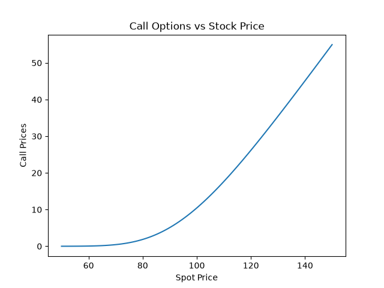
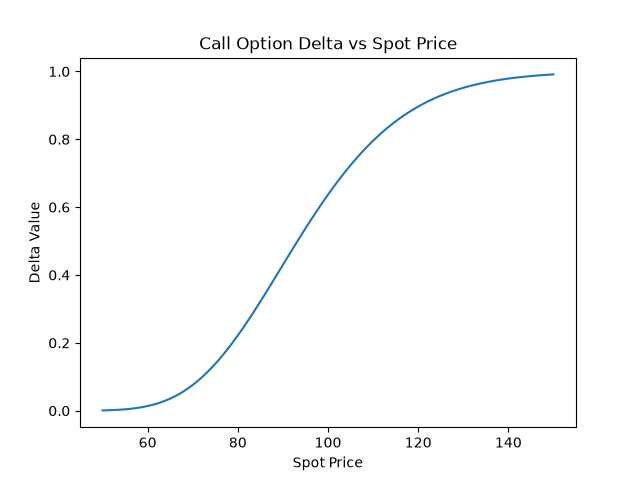
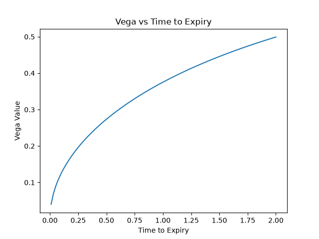

# black-scholes-option-pricer
Black-Scholes option pricer and Greeks calculator in Python

# What it does
-Prices European Call and put options using Black-Scholes formula
-Calculates the 5 main Greek values: delta, gamma, vega ,theta and rho
-Pulls a real data using yfinance for "SPY" stock and computes the model's price against the actual market price
-Visualises option price and Greek Variables' behaviour across ranges of spot prices and time expiries
-Automates test (pytest)

# Why I built it
I am a Maths and Economics student at Durham, and after completing an internship at FOIL AI & Data where I built forecasting models and AI pipelines, I wanted to apply my programming and problem-solving skills to a finance-related project alongside building a proper GitHub portfolio. Black-Scholes felt like a good starting point, as it is a foundational model in quantitative finance, and building the formulas instead of just calling a library forced me to understand the actual underlying mechanics.

# Key Findings
I validated the model against a real SPY call option (strike $775, expiring 17/08/2026) using live data form yfinance. Uisng the implied volatitily that Yahoo reported for this contract (1.56%), my model priced the option at essentially $0, even though the option was actually trading at $2.38. I investigated why this was happening and came to the conclusion that the implied volatilty reported wasn't accurate/reliable. I tested this by manually setting a range of more realistic volatilities to show that a sigma of 0.12  produced a model price of $2.16, which is much closer to the actual market price. Here I essentially reversed solved for volatility from the market price.

# Visuals 

# Project Structure

black-scholes-option-pricer/
  sources/
    pricing.py       - core pricing formulas and Greeks
    validation.py    - real market data comparison
    visualize.py     - charts
  tests/
    test_pricing.py  - automated tests
  images/             - saved chart screenshots
  requirements.txt

  # Setup and Usage

  1. Clone repo: git clone https://github.com/alexwrzesinski/black-scholes-option-pricer.git
   cd black-scholes-option-pricer

2. Create and activate a virtual environment:
   python -m venv venv
   venv\Scripts\activate

3. Install dependencies:
   pip install -r requirements.txt

4. Run the tests:
   pytest

5. Run the validation script (compares model to live market data):
   python sources/validation.py

6. Generate the charts:
   python sources/visualize.py

## Limitations and possible next steps

- Assumes European-style exercise (real US equity options are American-style, which can be exercised early)
- Does not account for dividends
- Relies on a free data source (yfinance) which occasionally returns unreliable bid/ask/implied volatility data, as demonstrated above
- Risk-free rate is a fixed estimate rather than pulled from a live source
- A production version could add a proper numerical implied-volatility solver, or switch to a paid data provider (e.g. Polygon.io) for more reliable real-time quotes

## License
MIT
